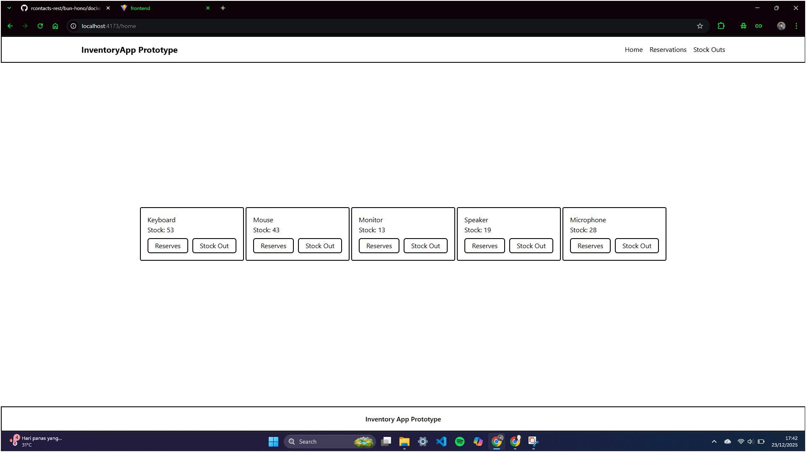
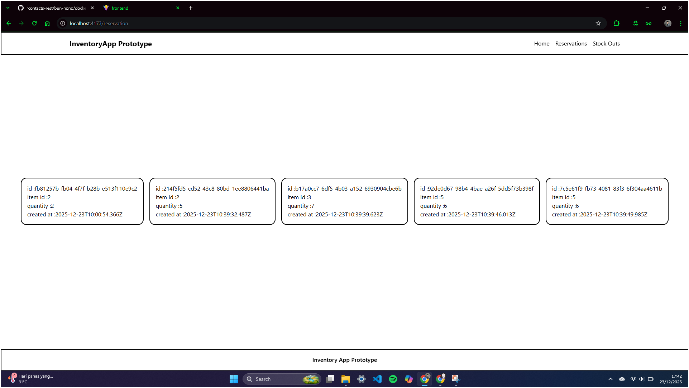
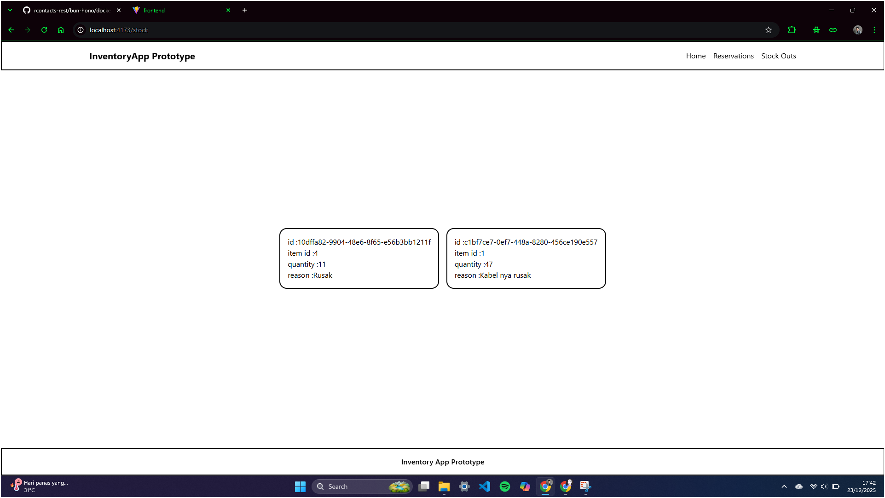

## Project Overview

Sistem ini digunakan untuk mengelola stok barang di gudang dengan fitur utama:

* Melihat daftar item dan stok saat ini
* Melakukan **reservasi stok** (alokasi sementara)
* Melakukan **stock-out** (pengurangan stok permanen)
* Melihat riwayat reservasi
* Melihat riwayat stock-out

Sistem **tidak pernah mengizinkan stok menjadi negatif**.

---

## Konsep Domain

* **Item**
  Merepresentasikan barang di gudang beserta jumlah stok saat ini.

* **Reservation**
  Merepresentasikan alokasi stok sementara (misalnya untuk pesanan pelanggan).
  Stok berkurang, tetapi secara konsep masih bersifat sementara.

* **Stock-Out**
  Merepresentasikan pengurangan stok secara permanen (misalnya karena barang rusak, hilang, atau dikirim).
  Stok berkurang dan tidak dapat dikembalikan.

Meskipun reservasi dan stock-out sama-sama mengurangi stok, keduanya memiliki **makna bisnis yang berbeda** dan dicatat sebagai entitas terpisah.

---

## Tech Stack

### Backend

* Node.js
* TypeScript
* Express.js
* In-memory data storage

### Frontend

* React
* TypeScript
* vite
* Tailwind CSS
* React Router
* TanStack Query (untuk data fetching)

---

## API Endpoints

### Items

* `GET /items`
  Mengambil semua item beserta stok saat ini.

### Reservation

* `POST /reserve`
  Melakukan reservasi stok item.
* `GET /reservations`
  Melihat semua riwayat reservasi.

### Stock-Out

* `POST /stock-out`
  Mengurangi stok secara permanen.
* `GET /stock-outs`
  Melihat semua riwayat stock-out.

---

## Cara Menjalankan Project


## Dengan Docker
pastikan berada di root saat ini , lalu ketik perintah

```
docker compose -f docker/docker-compose.yml up -d --build
```

## Tanpa Docker

### Backend

```bash
npm install
npm run dev
```

Server akan berjalan pada port yang telah dikonfigurasi (default: 3000).

### Frontend

```bash
npm install
npm run dev
```

Pastikan backend sudah berjalan sebelum frontend digunakan.

---

## Assumptions & Decisions

### Perbedaan Reservation dan Stock-Out

* **Reservation** digunakan untuk alokasi stok sementara dan dicatat sebagai riwayat reservasi.
* **Stock-Out** digunakan untuk pengurangan stok permanen dan dicatat sebagai riwayat stock-out.
* Keduanya mengurangi stok item, tetapi memiliki tujuan bisnis yang berbeda.

### Shortcut yang Diambil

* Menggunakan **in-memory database** (array) sesuai instruksi test.
* Tidak menggunakan autentikasi dan otorisasi.
* Tidak menggunakan DTO untuk menjaga implementasi tetap sederhana dan fokus pada business logic.
* Tidak menggunakan pagination atau filtering lanjutan.
* Tidak ada authentication dan pemisahan data beberapa user

### Peningkatan Jika Ada Waktu Lebih

* Menggunakan database nyata (PostgreSQL / MySQL).
* Menambahkan DTO dan validasi request yang lebih ketat.
* Menambahkan pagination pada history reservation dan stock-out.
* Menambahkan unit test untuk service layer.

## Desain Aplikasi Backend

Aplikasi backend menggunakan pendekatan **Clean Architecture sederhana** dengan pemisahan kode ke dalam tiga lapisan utama:

### 1. Domain
Berisi aturan bisnis inti yang bersifat independen dari framework dan teknologi.

Lapisan ini mencakup:
- Entity (`Item`, `Reservation`, `StockOut`)
- Custom error (`AppError`)
- Kontrak repository
- service 

Domain tidak memiliki ketergantungan ke Express (framework) atau implementasi penyimpanan data.

---

### 2. Infrastructure
Berisi detail teknis dan implementasi yang mendukung domain.

Lapisan ini mencakup:
- Implementasi repository (in-memory storage)
- Konfigurasi server dan middleware
- Implementasi teknis lainnya jika ada seeprti mungkin config database , logging , dan sebagainya 

Lapisan ini bergantung pada domain, tetapi domain tidak bergantung pada infrastructure.

---

### 3. API
Berisi lapisan antarmuka HTTP.

Lapisan ini mencakup:
- Route definition
- Controller
- Validasi request dasar

Lapisan API bertanggung jawab menerima request, memanggil service yang sesuai, dan mengembalikan response HTTP.

---

## Desain Aplikasi Frontend

Frontend dibangun menggunakan React dan TypeScript dengan pendekatan yang saya sendiri desain.

Aplikasi difokuskan pada pemisahan antara:
- Tampilan (UI)
- Data dari server

### Tampilan (UI)
- src/modules/[page]: sebagai implementasi pages nyata pada aplikasi SPA, dan src/modules/component sebagai pemisahan component yang hide secara langsung saat pages itu di render dan juga pemisaahan jika index terlalu panjang
- src/shared : reusable component yang di pakai di beberapa page

dan untuk logic tampilan bisa di implementasi di index tiap module pages , atau bisa juga di component nya tersebut

### Data dari server (API)
- src/api : sebagai instance axios 
- src/service : sebagai utility terhadap endpoint atau action tertentu untuk struktur request dan response
- hooks : memudahkan memakai tanstack untuk mencakup lingkup bagian dari endpoint businiss logic atau bisa di bilang semacam customhooks atau utility untuk api request response untuk mutasi data dan get data 
---


### SCREENSHOT APP

<p align="center">
    
    
    
</p>

## Penutup

Aplikasi ini dibuat dengan tujuan menunjukkan **pemahaman domain inventori**, **pemisahan tanggung jawab yang jelas**, dan **implementasi business logic yang benar** sesuai dengan instruksi technical test.